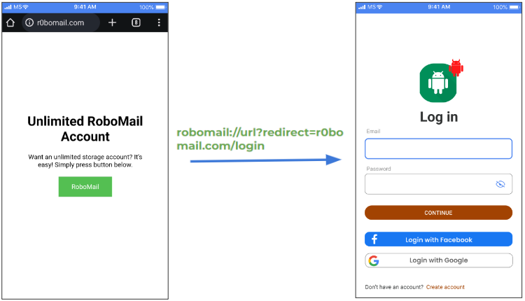

## Before Explanation: A Personal Journey into Bug Bounties

I work as an application security engineer and several key tasks stand out in our daily activities:

1. Testing new features developed by our developers.
2. Implementing and maintaining security tools to assist both the security team and developers.
3. Exploring new vulnerability areas! (Vulnerabilities evolve alongside new features and tools, so we must always stay at the forefront, ready to identify potential problems as soon as possible.)

To stay ahead with the third point, we employ a variety of methods:

* Listening to podcasts about hacking and vulnerabilities.
* Searching for guides or presentations on YouTube.
* Sharing our knowledge during meetings.
* Reading the latest blog posts about newly discovered vulnerabilities.
* Analyzing disclosed findings from bug bounty programs.

Regarding the last point, I've always regarded the bug bounty space as a professional arena where tough guys look for undiscovered vulnerabilities in applications that seem perfectly protected. I've always wanted to try my hand at it, so one day I decided it was time to dive in and start navigating that sea.

### Every Path has Pitfalls

Initially, I started exploring various bug bounty programs without a specific plan, hopping between different companies, applications and websites. However, this approach did not yield anything significant.

So, after a few unsuccessful weeks, I decided to target less popular bug bounty programs and set my sights on applications and websites offering lower rewards. This approach led to a few simple reports, but they were not accepted due to the stringent policies of the bug bounty programs. A few more weeks went by and I had almost lost my motivation.

Once again, I reviewed my plan. Even though I had reduced the number of programs, the problem remained the same — I was jumping into all sorts of different things too much! I needed to focus on one platform and its relevant issues!

So I didn’t stop there; I dedicated some of my free time to watching presentations from researchers in the past.

### The Turning Point: A Video on Deep Links in Android

An old video from the 2017 USENIX conference, caught my attention. It detailed a vulnerability in Android's login flow through deep links, which could lead to application hijacking.

https://www.usenix.org/conference/usenixsecurity17/technical-sessions/presentation/liu

It was the right sign at the right time for me to focus. I have always been interested in Android and even more, in how to exploit the apps on it. I just needed to dig deeper into all the details and find that needle in the haystack.

## Understanding Deep Links

Deep links facilitate seamless transitions between web and app environments on our phones. For instance, a few simple examples:

* Clicking a YouTube link in a browser opens the app due to a deep link.
* Searching for a local McDonald's and calling them involves deep links that direct the call action to a phone application.

So, in a more specific example, if you try to open RoboMail through the Chrome browser, Android will check all applications on the device.

Of course, only RoboMail will respond to that and will be opened, thanks to the intent filter with a deep link in it that exists in the application's manifest file. Example:

    <activity android:name=".MainActivity">
        <intent-filter>
            <action android:name="android.intent.action.VIEW" />
            <category android:name="android.intent.category.DEFAULT" />
            <category android:name="android.intent.category.BROWSABLE" />
            <data android:scheme="robomail" android:host="open" />
        </intent-filter>
    </activity>

### Deep Link Vulnerabilities

This is a very useful feature and it is used not only on Android but also on other platforms. However, let's limit ourselves to the Android theme and review the problems that can arise due to it — because all kinds of implementations have been invented with it! And if you play with it incorrectly, you can get badly burned.

Few examples:

#### Passwordless Login

Alright, so let's imagine we have the RoboMail app, and this app has an implementation to log in to your account from an email letter sent to your backup email.

So in our case, a user would be able to log in without a password, because the authentication code would be passed along with a deep link. So, anyone who would have access to your email or who could steal that link from you, would be able to log in to your RoboMail account from his device.

#### Misconfiguration

For another example, let's imagine a user is tricked and redirected to a fake website, which has a malicious deep link in it.

If an attacker manages to catch an impulsive user, who clicks that button on the website, he would be redirected back to the application. And because the deep link has an incorrect token, the user could be logged out from his account.

It doesn't look very serious — it's just an email provider, you would probably log in again and learn from your mistake. But that's the simplest thing that can be done with it.

#### CSRF (Cross-Site Request Forgery)

The same website, the same button. The attacker catches an impulsive user who clicks on that button. The moment they do that, they send an email to a specific address, with a specific subject and message that was written in the deep link. 

That could be dangerous. Imagine if you sent something to the police department or if the attacker managed to add a photo from your gallery and send it to himself.
 
We are only imagining at the moment, but all these options are possible and have existed in other applications in slightly different scenarios.

#### Password Bypass

Let’s say someone takes your phone, manages to unlock it if it was locked and opens the RoboMail app. They see that an email is already saved in memory!

So, if your entire inbox is encrypted with a master key, which you obtain with your password, the attacker tries to bypass it.

They just use a deep link for a specific section in your app (in this case, the inbox) and the application thinks that you have successfully entered your password. It finds the master key, which was saved in memory and opens the unencrypted inbox. That's all the attacker has to do, they're in.

#### XSS (Cross-Site Scripting)

Here's another example: a user receives a phishing email with a hidden malicious deep link in it. You think it’s a legitimate letter and press that button.

The moment you do that, your application processes that deep link with script code in it and because of a misconfiguration in the app's code, the application processes that script in the deep link as legitimate.

Well, the example is not very realistic and rare, but it illustrates the principle of the attack. And such attacks could be really dangerous if the attacker forces the application to run his code from the deep link.

#### Address Bar Spoofing

And the last example from the many possible options with deep links — let’s say a user is again tricked by a hidden malicious deep link which opens an application together with a webview that looks identical to the original one. There, you are prompted to provide your login information. If you do so, you would lose your credentials to your account.

## Real Story

After looking at a few examples, you should already have an idea of the many different problems that can arise from this. But now, let's focus a little more specifically.

While listening to presentation at the 2017 USENIX conference, I heard an interesting example he mentioned about the Careem and QatarTaxi applications.

Careem has an Android app that works like Uber and is quite popular in the Middle East. It has been integrated with hotels and restaurants. The smaller player, QatarTaxi, just decided to hijack every single deep link Careem had so that users might have a chance to open QatarTaxi instead.

This triggered me to realize that Google probably allows you to do that so easily — just upload an app in the Google Play Store that would target another application's deep links to get their users.

### Brainstorming

'That’s interesting' I thought and I tried to improvise — what else we can do if we uploaded such a malicious app that would target another application. Could an attacker manage to steal an account, for example?

Alright, let’s brainstorm how it should work. Again, we have the RoboMail app, which has the option to log in with Facebook or Google to your account.

So if a user successfully logs in to his account through Facebook or Google, he is redirected back with a deep link that holds an access token in it.

If the user is tricked and opens another app during that login flow, the attacker's application would get the access token along with it.

What does this mean? Well, my dear reader, it means that you just leaked access to your account to a malicious application. Now they can do whatever they want with your account and God bless you if you would be smart enough to change your password. That can save you if the application would terminate the old session that was provided.

How would it look in a real-life scenario? Here, you just have to choose the 'Mail' app, because why not? Humans are curious beings, after all.

### We Almost Ready to Lunch

Who would make this login flow vulnerable?

1. Let's imagine Bob, who initiates the login flow through Facebook.
2. The application redirects him to the Facebook app or to a Facebook webpage in a web browser.
3. Now, if the user chooses the correct app, all is good and the authorization code is redirected back to the correct application.
But if a malicious app is chosen, the attacker's app gets the authorization code. What could happen after that? There are a few possible outcomes, but I'll explain the simplest one — let's imagine the attacker sends that deep link to his phone and the moment he receives it, he initiates the login flow on his device with the RoboMail app.
4. He just changes the authorization code in one of the requests that occur during communication between his app and the server.
5. The server validates that code with Facebook to confirm it's really Bob.
6. And after successful validation,
7. It sends back an access token to the attacker's RoboMail app, so after that, the attacker is already inside your account and can do whatever he wants.

### First Catch

So, after brainstorming, I turned on the first few apps that have a Facebook or Google login flow and tried it. Well, the first few apps had that problem — what a surprise. I created a report and decided to wait for an answer. As I mentioned earlier, bug bounty programs have strict rules about which vulnerabilities are considered legitimate and which are not.

The first answer came after a week, the second after two. Both were approved and were awaiting a final decision. Another big surprise!

I didn't wait long, I turned on the biggest gear and started checking all the applications that are in the bug bounty programs. After all, you understand very well how many such programs there are, but how many of them are vulnerable?

### Statistics and Results

So, up until now, I've tested around 60 apps, of which 41 were vulnerable to that attack, which means that around 1 out of 3 applications are safe.

From the 41 tested vulnerable applications, only 1 had a Google issue (not because of the Google login flow, but because the entire login flow implementation was a mess) and the rest were with Facebook.

Now, another interesting thing: the unclear 10 applications which I tested had unique security implementations. To intercept their traffic, I had to write a manual Frida script and that's not so easy. Also, some of them just crashed, maybe because the app noticed that I use a rooted phone, even if I tried to hide/bypass it. So, I left them, perhaps for the future, to play with and do some experiments.

Another interesting fact: all safe applications did not have a Facebook login flow. So, is it possible to conclude that all applications with a Facebook login are vulnerable? Well, that's a complicated situation that I have to explain before we go forward.

In some scenarios or applications, users are vulnerable to that attack only if they are redirected to a web browser and for this to happen, the user must not have the FB app installed on their phone. In this case, the probability is much lower, but it is still a security hole.

So, up until now, I know that 9 reports were marked as duplicates, a few are still waiting for a decision, 16 were accepted and 14 applications were marked as not applicable or an accepted risk.

As I mentioned before, some bug bounty programs have specific rules and in this case, they did not accept my report only because it required installing that malicious app on the user's phone, so it was against their policy.

### Hot to Fix That?

So, what needs to be done to make it secure and why are so many apps still vulnerable to it? I’m talking about the root of the issue which was reported quite a long time ago (2017 USENIX).

1. Let's imagine Bob once more, who is initiating a login flow through Facebook.
2. The application redirects him to the Facebook app or to a Facebook webpage in a web browser, but this time, the application also creates a code challenge which is an encrypted code verifier — a random string using characters from letters and numbers.
3. Now, if the user chooses the correct app, all is still good and the authorization code is redirected back to the right application.
Nothing is wrong even if the user chooses the wrong application
Because if the user is tricked into the wrong application, the attacker doesn't know anything about the code_verifier.
4. Because only the real app knows about it and can use it in the last step before a successful login.
5. The server validates that authorization code and code verifier with the code_challenge which Facebook received earlier.
6. And after successful validation, it sends back the access token to the correct RoboMail app.

So, the fix is quite simple. Why then are all the Facebook applications that I tested still vulnerable to that?

Well, the answer seems pretty simple: Facebook is still testing this functionality.

## Conclusion

* Apps that have a Facebook login flow are in a very big chance still vulnerable to this.
* Be careful what you're doing online. That’s just one issue that I disclosed, but there are many more lurking around — not even mentioning that a deep link is just one of the many functions that our phones have.
* And never stop or give up on learning something new, even if you fail sometimes, as it could lead to an interesting story.

